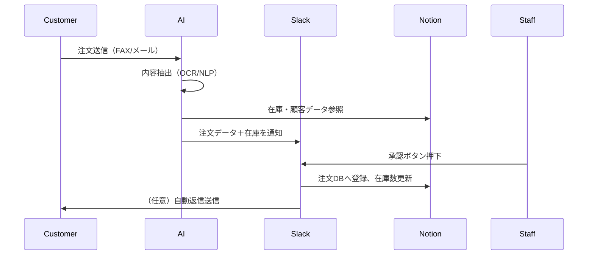

# 📄 注文処理システム仕様書（プロトタイプ設計）

## 1. 🎯 システム目的と背景

ネットショップや小売業では、FAX・電話・メール・LINEなど多様なチャネルから注文を受ける必要がある。これにより人的負担が増大し、人手不足が売上のボトルネックとなっている。本システムは、AIと自動化によって以下を実現する：

- 注文の受信・内容抽出の自動化
- 在庫確認と注文登録の自動化
- Slackを使った承認ワークフロー
- 顧客との返信の自動化（任意）

---

## 2. 👥 ユーザーとステークホルダー

| 役割       | 操作内容             | 特記事項                                |
|------------|----------------------|----------------------------------------|
| 店員       | Slackでの確認・承認   | 日常的な業務で操作                    |
| 店長       | Slackでの承認         | 承認や修正指示                         |
| 経営者     | システム導入・管理     | 承認ログ確認・最終判断など             |

---

## 3. 🔁 注文処理フロー



---

## 4. ⚙️ 自動化対象と優先度

| 機能項目                         | 優先度   | 人の関与             |
|----------------------------------|----------|----------------------|
| 注文内容抽出（OCR/LLM）         | 必須     | Slackでの承認あり     |
| 在庫確認                         | 必須     | 自動                 |
| 在庫不足時の返信生成            | できれば | 承認後送信が理想       |
| 注文のシステム登録              | 必須     | Slack承認後自動登録   |
| Slack通知・承認                 | 必須     | 承認者を記録         |
| 顧客との返信（メール/LINE）     | できれば | テンプレート＋承認     |

---

## 5. 🗂️ データ構造（Notionデータベース）

### 商品マスタ（products）
| id    | name             | stock | last_updated        |
|-------|------------------|-------|---------------------|
| A001  | ノートパソコン    | 12    | 2025-07-09T09:15:00 |

### 顧客マスタ（customers）
| name       | first_order_date | is_existing |
|------------|------------------|-------------|
| 山田商店    | 2023-05-01       | true        |

### 注文管理（orders）
| order_id | customer_name | product_id | quantity | delivery_date | status     | approved_by |
|----------|----------------|-------------|----------|----------------|------------|-------------|
| ORD001   | 山田商店        | A001        | 3        | 2025-07-15     | 承認済      | tanaka      |

---

## 6. 💬 Slackワークフロー仕様

### 通知例
```
📦 新しい注文が届きました

🧾 原文：FAX内容 or メール文
🔍 抽出内容：
- 顧客: 山田商店（新規）
- 商品: A001（ノートパソコン）
- 数量: 3
- 配送希望日: 2025-07-15
- 在庫: ✅ 在庫あり

👇 登録してよろしいですか？
[✅ 承認] [❌ 差し戻し]
```

### 承認後の動作
- 注文DBに登録（Notion）
- 在庫数更新（Notion）
- 顧客に自動返信（メール or LINE）
- Slack上で承認者を表示

---

## 7. 🛠 技術スタック・構成案

| コンポーネント | 技術候補                          |
|----------------|----------------------------------|
| OCR            | Tesseract / Azure Form Recognizer|
| LLM            | OpenAI GPT-4o                    |
| データストア    | Notion API                       |
| Slack連携      | Slack Bot (Bolt for Python)      |
| データ連携     | MCP Toolkit                      |
| RAG            | faiss + Markdown/Notion辞書       |
| 開発環境        | Dockerローカル → クラウド化予定   |

---

## 8. 🔎 RAG構成（精度向上）

### 目的：
- 商品名のゆらぎ、略称、型番違いの補正
- 顧客名の表記揺れ対応

### 構成要素：
- `products.md`：商品辞書（類義語・別名含む）
- Retriever：`faiss` ベースのベクトル検索
- Generator：GPT-4o

---

## 9. 📈 将来の拡張性

- 外部ECシステム連携（Shopify, BASE など）
- LINE公式アカウント連携（顧客返信）
- 決済・物流システムとの統合（ヤマト、佐川等）

---

## 10. 🔐 非機能要件

| 要件項目     | 内容                                 |
|--------------|--------------------------------------|
| 同時処理件数 | 1日10件（初期）                      |
| リアルタイム性 | 注文受信後、即時処理                 |
| セキュリティ | 顧客情報と注文データの機密保持       |
| 運用環境     | Dockerローカル → GCP等への拡張可能   |
| 拡張方針     | 必要に応じてAPIや外部連携を導入予定   |

---

> 本仕様書は、ChatGPT Codexにより注文処理システムを段階的に実装していくための設計資料です。

