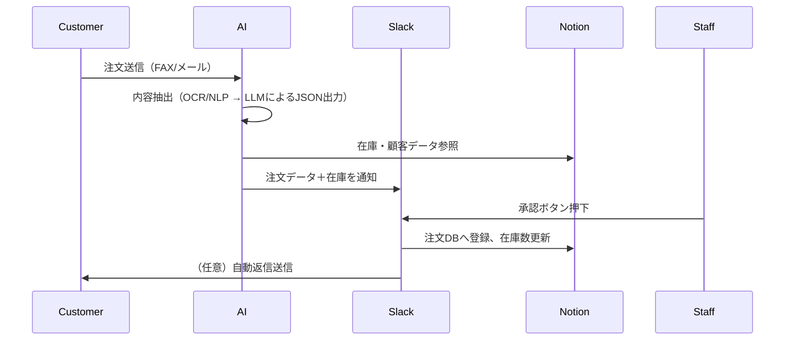

# 📄 注文処理システム仕様書（プロトタイプ設計）

## 1. 🎯 システム目的と背景

ネットショップや小売業では、FAX・電話・メール・LINE など多様なチャネルから注文を受ける必要がある。これにより人的負担が増大し、人手不足が売上のボトルネックとなっている。本システムは、AI と自動化によって以下を実現する：

- 注文の受信・内容抽出の自動化
- 在庫確認と注文登録の自動化
- Slack を使った承認ワークフロー
- 顧客との返信の自動化（任意）

---

## 2. 👥 ユーザーとステークホルダー

| 役割   | 操作内容             | 特記事項                   |
| ------ | -------------------- | -------------------------- |
| 店員   | Slack での確認・承認 | 日常的な業務で操作         |
| 店長   | Slack での承認       | 承認や修正指示             |
| 経営者 | システム導入・管理   | 承認ログ確認・最終判断など |

---

## 3. 🔁 注文処理フロー



---

## 4. ⚙️ 自動化対象と優先度

| 機能項目                    | 優先度   | 人の関与             |
| --------------------------- | -------- | -------------------- |
| 注文内容抽出（OCR/LLM）     | 必須     | Slack での承認あり   |
| 在庫確認                    | 必須     | 自動                 |
| 在庫不足時の返信生成        | できれば | 承認後送信が理想     |
| 注文のシステム登録          | 必須     | Slack 承認後自動登録 |
| Slack 通知・承認            | 必須     | 承認者を記録         |
| 顧客との返信（メール/LINE） | できれば | テンプレート＋承認   |

---

## 5. 🗂️ データ構造（Notion データベース）

### 商品マスタ（products）

| id   | name           | description                                         | price | stock | created_at          | last_updated        |
| ---- | -------------- | --------------------------------------------------- | ----- | ----- | ------------------- | ------------------- |
| A001 | ノートパソコン | 15 インチディスプレイ搭載の軽量ノートパソコンです。 | 98000 | 12    | 2025-05-10T09:00:00 | 2025-07-15T10:00:00 |

### 顧客マスタ（customers）

| id      | customer_name | email              | first_order_date | is_existing | created_at |
| ------- | ------------- | ------------------ | ---------------- | ----------- | ---------- |
| CUST001 | 山田商店      | yamada@example.com | 2023-05-01       | true        | 2025-05-01 |

### 注文管理（orders）

| order_id | customers (Relation) | products (Relation) | quantity | delivery_date | status (approved, cancel, unprocessed, completed) | approved_by | created_at |
| -------- | ------------------- | ------------------- | -------- | ------------- | ------------------------------------------------- | ----------- | ---------- |
| ORD001   | CUST001              | A001                | 3        | 2025-07-15    | 承認済                                             | tanaka      | 2025-07-12 |

---

## 6. 💬 Slack ワークフロー仕様

### 通知例

```
📦 新しい注文が届きました

🧾 原文：FAX内容 or メール文
🔍 抽出内容：
- 顧客: 山田商店（新規）
- 商品: A001（ノートパソコン）
- 数量: 3
- 配送希望日: 2025-07-15
- 在庫: ✅ 在庫あり

👇 登録してよろしいですか？
[✅ 承認] [❌ 差し戻し]
```

### 承認後の動作

- ボタン押下イベントを受信し、注文 ID を特定
- Slack Modalを使った抽出結果の確認・修正UIを表示し、最終承認前にユーザーが内容を修正可能とする
- Notion の customers データベースを参照し、顧客が存在しない場合は新規登録
- Notion の orders データベースに注文を登録（order_id, customer_name, product_id, quantity, delivery_date, status='承認済', approved_by）
- products データベースの stock を quantity 分減算し更新
- Slack メッセージを更新し、承認者と承認日時を表示
- 顧客への自動返信（メール or LINE）をテンプレートと承認情報を含めて送信

---

## 7. 🛠 技術スタック・構成案

| コンポーネント | 技術候補                          |
| -------------- | --------------------------------- |
| OCR            | Tesseract / Azure Form Recognizer |
| LLM            | OpenAI GPT-4o                     |
| データストア   | Notion API                        |
| Slack 連携     | Slack Bot (Bolt for Python)       |
| データ連携     | MCP Toolkit                       |
| RAG            | faiss + Markdown/Notion 辞書      |
| 開発環境       | Docker ローカル → クラウド化予定  |

---

## 8. 🔎 RAG 構成（精度向上）

### 目的：

- 商品名のゆらぎ、略称、型番違いの補正
- 顧客名の表記揺れ対応

### 構成要素：

- `products.md`：商品辞書（類義語・別名含む）
- Retriever：`faiss` ベースのベクトル検索
- Generator：GPT-4o
- バッチ処理で辞書ドキュメントを埋め込み化し Faiss に投入、メール抽出後に類似度検索で表記揺らぎを補正

---

## 9. 📈 将来の拡張性

- メール受信リスナー実装（IMAP/POP3 監視ポーリング or IDLE）
- 外部 EC システム連携（Shopify, BASE など）
- LINE 公式アカウント連携（顧客返信）
- 決済・物流システムとの統合（ヤマト、佐川等）

---

## 10. 🔐 非機能要件

| 要件項目       | 内容                                  |
| -------------- | ------------------------------------- |
| 同時処理件数   | 1 日 10 件（初期）                    |
| リアルタイム性 | 注文受信後、即時処理                  |
| セキュリティ   | 顧客情報と注文データの機密保持        |
| 運用環境       | Docker ローカル → GCP 等への拡張可能  |
| 拡張方針       | 必要に応じて API や外部連携を導入予定 |

---

> 本仕様書は、ChatGPT Codex により注文処理システムを段階的に実装していくための設計資料です。
